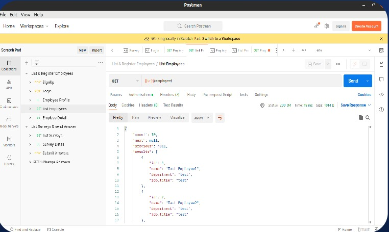

# Employee Survey System 


  - [Features](#features)
  - [Demos](#demos)
  - [Run-App](#run-app)

## Features
##### **The system has three data objects:**
- Question
- Answers 
- Survey --> list of rating questions - has three types (general, followers, reversed) - has start date - has an end date 

---
##### views (implemented as a restful API and template view):
1.  **Employee tree view**  -> *set up by the admin*     Every employee can have a parent employee that they report to as the above fig 
    
	
2. **survey view** 

    1. view for due surveys [list]
    2. View for submitted surveys [list]
    3. View for fetching a single survey question [detail]
    4. view for submitting the answer for the survey  [POST - Form]
    5. Employee real-time chatting system using WebSockets 
---


## Demos

### Reconstruction Demo 
 
 
 


## Run-App
1. **_install project dependencies_**
```sh
pip install -r requirements.txt
```
2. **_Run the application_**
```sh
docker compose up


